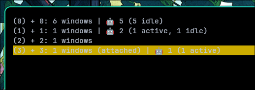
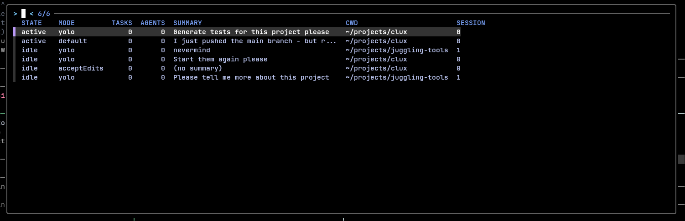

# clux

[![Contributors][contributors-shield]][contributors-url]
[![Forks][forks-shield]][forks-url]
[![Stargazers][stars-shield]][stars-url]
[![Issues][issues-shield]][issues-url]
[![MIT License][license-shield]][license-url]
[![Crates.io][crates-shield]][crates-url]

A tmux plugin that shows the status of Claude Code sessions running in your tmux sessions. Also works as a standalone CLI.

Written in Rust.

## What it does

clux looks at your `~/.claude/sessions/` directory, figures out which Claude Code sessions are running, and maps them to your tmux panes by walking the process tree. It then shows you the status of each session right in your tmux session picker.

For each session, clux can tell you:

- **State** -- active (waiting for input) or idle (Claude finished responding)
- **Mode** -- default, acceptEdits, yolo, or plan
- **Background work** -- how many tasks and sub-agents are running
- **Summary** -- what Claude is currently working on

When you hit `prefix + s` to switch sessions, you can see which ones have Claude running in them without having to check each one manually. There's also a dedicated Claude picker (`prefix + a` by default) that shows only sessions with Claude, sorted by most recent activity.





## Getting started

You need [tmux](https://github.com/tmux/tmux) and [Claude Code](https://claude.ai/code) installed.

### Install as a tmux plugin (recommended)

Add this to your `.tmux.conf`:

```sh
set -g @plugin 'calthejuggler/clux'
```

Then press `prefix + I` to install.

### Install as a standalone CLI

If you just want the `clux` binary without the tmux plugin setup, you have a few options.

**From crates.io:**

```sh
cargo install clux
```

**From the latest release:**

```sh
curl -fsSL https://raw.githubusercontent.com/calthejuggler/clux/main/scripts/install.sh | bash
```

This downloads a pre-built binary for your platform to `~/.local/bin/clux`. You can also pass a custom path:

```sh
curl -fsSL https://raw.githubusercontent.com/calthejuggler/clux/main/scripts/install.sh | bash -s -- /usr/local/bin/clux
```

Pre-built binaries are available for Linux and macOS (both x86_64 and aarch64).

**From source:**

```sh
cargo install --git https://github.com/calthejuggler/clux
```

## CLI usage

```
clux <COMMAND>

Commands:
  update  Update tmux session variables with Claude Code status
  list    List Claude Code sessions (tab-separated)
  select  Open tmux choose-tree with Claude Code status
  pick    Open a Claude-only session picker (fzf or tmux menu)
```

`clux list` is the most useful one outside of tmux. It prints a tab-separated table of all Claude Code sessions it can find, with their state, mode, task/agent counts, summary, working directory, and tmux session name.

`clux update`, `clux select`, and `clux pick` all require tmux to be running.

Each command that accepts a filter argument supports these values:

| Filter | Shows |
|--------|-------|
| `all` | All sessions (default) |
| `has-claude` | Only sessions with Claude running |
| `active` | Only sessions with Claude waiting for input |
| `idle` | Only sessions where Claude finished responding |

## Configuration

These options are set in your `.tmux.conf` and only apply when using clux as a tmux plugin.

| Option | Default | Description |
|--------|---------|-------------|
| `@clux-key` | `s` | Key to bind the session picker (after prefix) |
| `@clux-claude-key` | `a` | Key to bind the Claude-only picker (after prefix) |
| `@clux-format` | ` \| {total} ({detail})` | Format string for session status |
| `@clux-filter-binds` | _(none)_ | Comma-separated `key:filter` pairs for filtered pickers |
| `@clux-fzf` | _(on)_ | Set to `off` to use tmux menus instead of fzf in the Claude picker |

### The Claude picker

The Claude picker (`prefix + a`) gives you a focused view of just your Claude sessions. It shows state, mode, task count, sub-agent count, a summary of what Claude is doing, and the working directory. Sessions are sorted by most recent activity.

If you have `fzf-tmux` installed, it uses that for fuzzy finding. Otherwise it falls back to a tmux display-menu. You can force the menu with `set -g @clux-fzf 'off'`.

### Format placeholders

| Placeholder | Description | Example |
|-------------|-------------|---------|
| `{total}` | Total Claude sessions | `3` |
| `{active}` | Sessions waiting for input | `2` |
| `{idle}` | Sessions finished responding | `1` |
| `{detail}` | Smart summary (omits zero counts) | `2 active, 1 idle` |

### Example

```sh
set -g @clux-key 's'
set -g @clux-claude-key 'a'
set -g @clux-format ' | {active}/{total}'
set -g @clux-filter-binds 'S:has-claude,A:active,I:idle'
```

This binds `prefix + s` to the full session picker, `prefix + a` to the Claude picker, `prefix + S` to show only sessions with Claude, `prefix + A` for active sessions, and `prefix + I` for idle sessions.

## Roadmap

- [x] Configurable keybinding
- [x] Customizable status bar format
- [x] Session filtering options
- [x] Claude picker with mode, tasks, and sub-agent info
- [x] fzf integration
- [x] Standalone CLI with proper `--help`
- [x] Published on crates.io
- [ ] Other coding agent softwares

Check the [open issues](https://github.com/calthejuggler/clux/issues) for more.

## Contributing

If you have an idea or find a bug, open an issue or submit a pull request. Fork the repo, make your changes on a branch, and open a PR.

## Contact

Cal Courtney - [@calthejuggler](https://github.com/calthejuggler)

## Acknowledgments

- [Claude Code](https://claude.ai/code)
- [tmux](https://github.com/tmux/tmux)

[contributors-shield]: https://img.shields.io/github/contributors/calthejuggler/clux.svg?style=for-the-badge
[contributors-url]: https://github.com/calthejuggler/clux/graphs/contributors
[forks-shield]: https://img.shields.io/github/forks/calthejuggler/clux.svg?style=for-the-badge
[forks-url]: https://github.com/calthejuggler/clux/network/members
[stars-shield]: https://img.shields.io/github/stars/calthejuggler/clux.svg?style=for-the-badge
[stars-url]: https://github.com/calthejuggler/clux/stargazers
[issues-shield]: https://img.shields.io/github/issues/calthejuggler/clux.svg?style=for-the-badge
[issues-url]: https://github.com/calthejuggler/clux/issues
[license-shield]: https://img.shields.io/github/license/calthejuggler/clux.svg?style=for-the-badge
[license-url]: https://github.com/calthejuggler/clux/blob/main/LICENSE
[crates-shield]: https://img.shields.io/crates/v/clux.svg?style=for-the-badge
[crates-url]: https://crates.io/crates/clux
